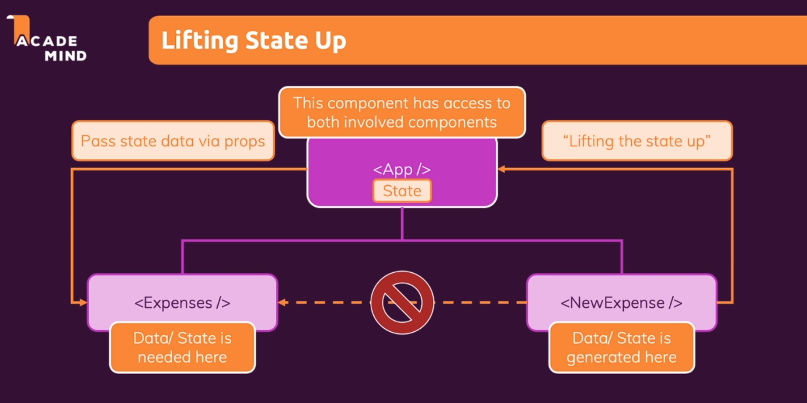
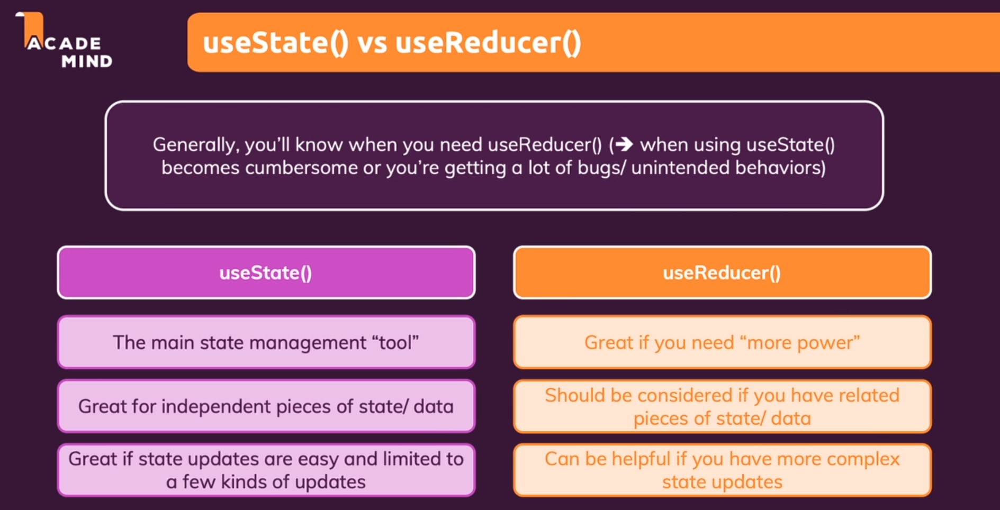
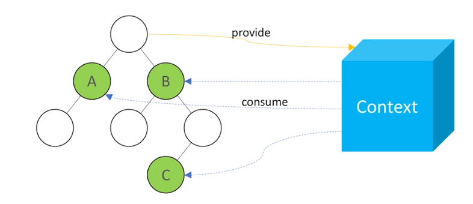
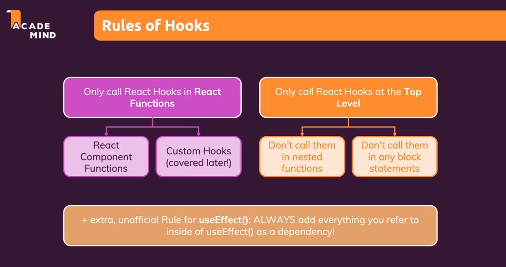

# React-Maximilian-Course
#### Course from Udemy - Maximiliam React course

---
### Module :one: is introductory
---
### Module :two: is a revision of Javascript (ES6)
---
### Module :three: - React Basics and components usage:
- What is a frontend framework
- differences between frontend frameworks (Angular, React, Vue)
- How React Works
- Components usage and creation
- Props
- Composition
---
### Module :four: - React States and event handling:

- Event listener
- What is a react state
- State with user inputs
- Multiple states
- Relationship between states (Two-way Binding)
- Children to parent communication (Lifting the state up)
- Types of components (controlled/uncontrolled / Stateless/Stateful)

---
### Module :five: - Rendering dynamic lists and using conditionals:

- Rendering list using map (already done before)
- Use of conditionals
- Applying dynamic styles (CSS)
---
### Project 1 - Expense list by year - Finished :heavy_check_mark:
---
### Module :six: - Styling components:

- Inline styles
- Styled components
- CSS Modules

---
### Project 2 - Course goal (styling) - Finished :heavy_check_mark:
---
### Module :seven: - Debugging the react app:

- Breakpoints
- React DevTools
---
### Project 3 - Course goal (debugging) - Finished :heavy_check_mark:
---
### Module :eight: - Practice with previous content:
- Simple app with form validation and modal (for showing validation errors)
---
### Project 4 - Form with modal - Finished :heavy_check_mark:
---
### Module :nine: - React Tools - Fragments, Portals & Refs :
- React Fragment (Prevents DIV soup)
- Portal (Render child components outside the DOM Hierarchy)
- Refs (Direct Access to the components properties) - it turns into uncontrolled components
---
### Project 5 - Form with modal (With extra concepts) - Finished :heavy_check_mark:
---
### Module :one::zero: - React Hooks (useEffect, useReducer, useContext, useRef) :

- useEffect (Change components after rendering them)
- useReducer (separating the state management from the rendering logic of the component)
- useContext (Global state)
---
### Project 6 - Login page (React Hooks) - Finished :heavy_check_mark:
---
