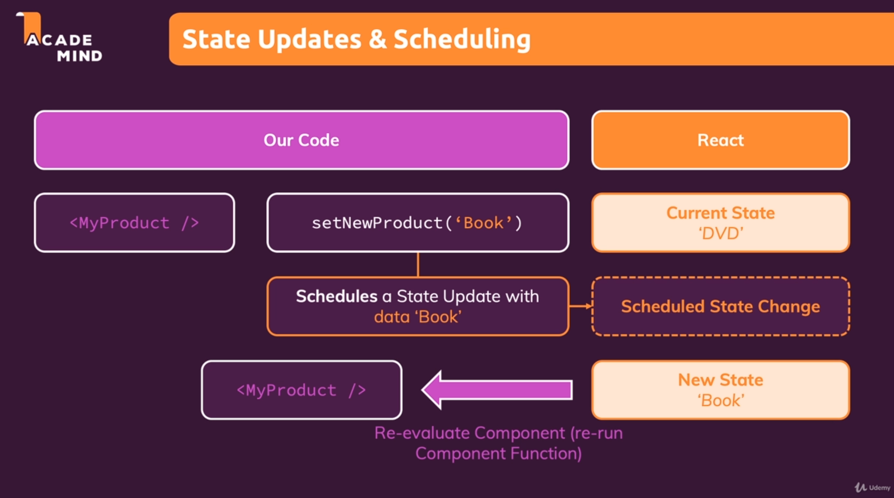

# React-Maximilian-Course

### Course from Udemy - Maximiliam React course

#### The Readme has been constantly updated by me, with information both from the course and from other video classes/internet sources (including the ReactJS documentation itself).

#### The content serves both portfolio and help for anyone studying React.

---
### Module :one: is introductory
---
### Module :two: is a revision of Javascript (ES6)

Destructuring assignment: [Doc](https://developer.mozilla.org/pt-BR/docs/Web/JavaScript/Reference/Operators/Destructuring_assignment).

---
### Module :three: - React Basics and components usage:
- What is a frontend framework
- differences between frontend frameworks (Angular, React, Vue)
- How React Works
- Components usage and creation
- Props
- Composition
---
### Module :four: - React States and event handling:


- Event listener
- What is a react state
- State with user inputs
- Multiple states
- Relationship between states (Two-way Binding)
- Children to parent communication (Lifting the state up)
- Types of components (controlled/uncontrolled / Stateless/Stateful)

---
### Module :five: - Rendering dynamic lists and using conditionals:

- Rendering list using map (already done before)
- Use of conditionals
- Applying dynamic styles (CSS)
---
### Project 1 - Expense list by year - Finished :heavy_check_mark:
---
### Module :six: - Styling components:

- Inline styles
- Styled components
- CSS Modules

---
### Project 2 - Course goal (styling) - Finished :heavy_check_mark:
---
### Module :seven: - Debugging the react app:

- Breakpoints
- React DevTools
---
### Project 3 - Course goal (debugging) - Finished :heavy_check_mark:
---
### Module :eight: - Practice with previous content:
- Simple app with form validation and modal (for showing validation errors)
---
### Project 4 - Form with modal - Finished :heavy_check_mark:
---
### Module :nine: - React Tools - Fragments, Portals & Refs :
- React Fragment (Prevents DIV soup)
- Portal (Render child components outside the DOM Hierarchy)
- Refs (Direct Access to the components properties) - it turns into uncontrolled components
---
### Project 5 - Form with modal (With extra concepts) - Finished :heavy_check_mark:
---
### Module :one::zero: - React Hooks (useEffect, useReducer, useContext, useRef w/ Imperative Handler) :

"With the new addition of hooks( along with React 16.8), functional components could maintain states and lifecycle features without using classes. Simply hooks are features that allow you to “hook into” React state and lifecycle features from function components."

React hooks examples_1: [Example 1](https://blog.logrocket.com/react-hooks-cheat-sheet-unlock-solutions-to-common-problems-af4caf699e70/).

React hooks examples_2: [Example 2](https://enlear.academy/types-of-react-hooks-best-practices-45c275b55b1f).

#### useReducer: 


#### useContext:


#### Rules of React hooks:


- useEffect (Change components after rendering them)
- useReducer (separating the state management from the rendering logic of the component)
- useContext (Global state)
---

### Project 6 - Login page (React Hooks) - Finished :heavy_check_mark:

---
Module :one::one: - Practice with previous content (especially react tools and hooks):
application simulating a web commerce with adding items to a cart and changing quantities
---
### Project 7 - Food Oder App - Finished :heavy_check_mark:
---
### Module :one::two: - React behind the scenes + optimization techniques:

---

### components to the real DOM:


### Changes in React that affects the DOM:


### Re-Evaluating components && Re-rendering the DOM:


### About state:



Getting the previous value of the state:

```javascript
const [value, setValue] = useState(false);

// Getting the last snapshot of the state and updating.
setValue(prevValue => !prevValue)
```

---

## When there is a change to a component (like props or state change) all of its child components are re-evaluated along with it. In a large application with a component with many children, this can be a huge computational cost.

## Possible solutions:

#### React memorizes the result of the component. Before React renders the component again, it validates that the props (primitives) are the same, if so, it skips rendering.

### React.memo | useMemo (Memoization):

#### It consists of storing the return value of a function from the input values (Parameters). In this way, a component that receives a props from another, will only re-evaluate if different values from the previous ones (which are saved by useMemo) are passed. These new values will then be saved for later comparison. ###

Example: [Example](https://medium.com/reactbrasil/react-usememo-na-prática-692110771c01).

*React.memo() is a higher-order component that involves components that only render when their props are changed. useMemo is a react hook that wraps functions to ensure they are only rendered when the dependency array changes.*

### useCallback:

### useCallback has the same principle as useMemo, the difference is that it is used when a callback is called. 

---
### Project 8 - memo and useCallback pratice - Finished :heavy_check_mark:
---
### Project 9 - useMemo pratice - Finished :heavy_check_mark:
---
